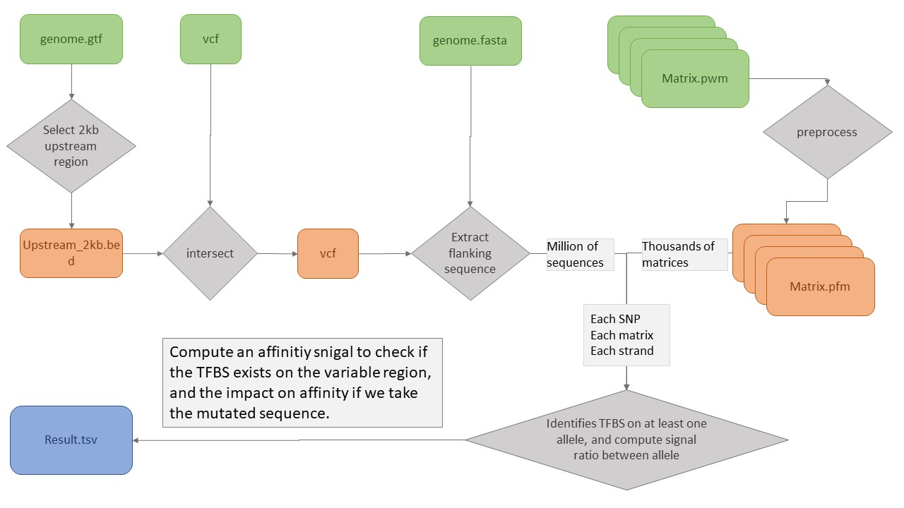

# Hackathon_NextFlow_Nov2020

**Goal : Find regulatory SNP candidate (rSNP)**

Does the SNP impact the surrounding sequence affinity with a TF ? (likelihood the TF will bind with this sequence)

* Principle

step1:  
We expect to find rSNP candidate in a 2kb window upstream of TSS start. We filter the SNP file, keeping only the corresponding SNP.
(Bedtools intersect)

step2:  
For each filtered SNP, we create ref and alt sequences correponding to SNP ref and alt base and its surrounding sequences (+/- 14bp)
(Bedtools getfasta)

step3:  
matrices download from existing database (TRANSFAC,JASPAR, HOCOMOCO) and preparation (PWM <-> PFM)

step4:  
For each filtered SNP, we compare the ref and alt sequences to each TF matrices  
Does ref and/or alt sequence have a strong affinity with TF (putative TFBS)?  
Does the SNP impact the putative TFBS ?  

* inputs
    - Genome reference file: Fasta and annotation in GTF file
    - Variant file : in VCF format
    - TFBS pattern matrices : directory of PWM files (one file per TFBS)

* outputs
    - TSV file with regulatory variant, and metadata such as TFBS name, score of affinity, impacting score

* Flowchart

